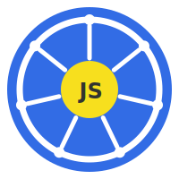

<p align="center">
  
</p>

<h1 align="center">k8s.js</h1>

<p align="center">
  An interactive Kubernetes cluster simulator that runs entirely in the browser.
</p>

---

k8s.js simulates a real Kubernetes control plane in React — complete with controllers, a scheduler, kubelet, and a built-in console for running `kubectl` commands. There is no backend; the entire cluster state lives in a React reducer and evolves through simulated controllers running as hooks.

## Features

- **Full resource lifecycle** — Pods, Deployments, ReplicaSets, DaemonSets, Jobs, CronJobs, Services, Endpoints, Nodes
- **Simulated controllers** — Deployment rolling-update controller, ReplicaSet controller, DaemonSet controller, Job controller, CronJob controller, Endpoints controller, Scheduler, and Kubelet all run concurrently as React hooks
- **kubectl console** — type commands directly in the UI; output is printed to an in-browser terminal
- **Node management** — cordon, uncordon, and drain nodes; the scheduler respects `unschedulable` taints
- **Networking primitives** — `ping` and `curl` commands resolve Service DNS, pick random endpoints (round-robin), and validate ports

## Getting started

```bash
yarn
yarn dev
```

Open [http://localhost:5173](http://localhost:5173) in your browser.

## Example commands

Try these in the built-in console.

### Pods

```sh
# Run a standalone pod
kubectl run nginx --image=nginx

# List pods
kubectl get pods

# Inspect a pod
kubectl describe pod nginx
```

### Deployments

```sh
# Create a deployment with 3 replicas
kubectl create deployment web --image=nginx --replicas=3

# Watch it scale up
kubectl get deployments

# Rolling update to a new image
kubectl set image deployment/web nginx=nginx:1.25

# Scale down
kubectl scale deployment/web --replicas=1
```

### Services & networking

```sh
# Expose the deployment as a ClusterIP service
kubectl expose deployment web --port=80 --target-port=80

# List services
kubectl get services

# Ping the service by DNS name
ping web

# Make an HTTP request through the service
curl web
```

### DaemonSets

```sh
# Create a DaemonSet (one pod per node)
kubectl create daemonset logger --image=fluentd

kubectl get daemonsets
kubectl get pods
```

### Jobs & CronJobs

```sh
# Run a one-off job
kubectl create job migrate --image=alpine --completions=3 --parallelism=2

kubectl get jobs

# Schedule a recurring job
kubectl create cronjob heartbeat --image=alpine --schedule='*/1 * * * *'

kubectl get cronjobs
```

### Node management

```sh
# List nodes and their status
kubectl get nodes

# Cordon a node (prevent new scheduling)
kubectl cordon node-2

# Drain a node (evict all pods)
kubectl drain node-3

# Bring it back
kubectl uncordon node-3
```

### Querying all resources

```sh
# All resources in the default namespace
kubectl get all

# All namespaces
kubectl get pods -A
kubectl get deployments --all-namespaces
```

## Architecture

| Layer | Implementation |
|---|---|
| State store | `useReducer` in `src/store/store.ts` |
| Controllers | React hooks in `src/controllers/` |
| Command parser | `src/command.ts` — tokenises and dispatches to `kubectl()` |
| UI | `src/components/` — resource tabs + console panel |

Controllers run as concurrent `useEffect` hooks; each owns its resource's status, mirroring real Kubernetes controller-manager architecture.
