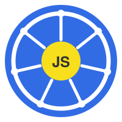

<p align="center">
  
</p>

<h1 align="center">k8s.js</h1>

<p align="center">
  An interactive Kubernetes cluster simulator that runs entirely in the browser.
</p>

---

k8s.js simulates a real Kubernetes control plane in React — complete with controllers, a scheduler, kubelet, and a built-in console for running `kubectl` commands. There is no backend; the entire cluster state lives in a React reducer and evolves through simulated controllers running as hooks.

## Features

- **16 resource types** — Pods, Deployments, ReplicaSets, DaemonSets, StatefulSets, Jobs, CronJobs, Services, Endpoints, ConfigMaps, Secrets, PersistentVolumes, PersistentVolumeClaims, StorageClasses, Nodes, Events
- **Simulated controllers** — Deployment, ReplicaSet, DaemonSet, StatefulSet, Job, CronJob, Endpoints, Service, Scheduler, Kubelet, PVC Binder, and Local Path Provisioner all run concurrently as React hooks
- **kubectl console** — type commands directly in the UI; output is printed to an in-browser terminal
- **kubectl apply** — declarative YAML manifests; supports multi-document files and all core resource kinds
- **Rollout management** — `kubectl rollout status/restart/undo/history` with revision tracking
- **initContainers** — pods with init containers show `Init:0/N` → `Init:N/N` → `Running` progression
- **Storage** — PVCs bind to PVs automatically; StorageClass triggers dynamic provisioning via a simulated local-path provisioner
- **ConfigMaps & Secrets** — create with `--from-literal`, reference in pod env vars; values masked in `describe secret`
- **Node management** — cordon, uncordon, and drain nodes; the scheduler respects `unschedulable` taints
- **Networking** — `ping`, `curl`, and `nslookup` resolve Service DNS, pick endpoints, and validate ports
- **Output formats** — `-o yaml` and `-o json` on any `get`; `-l` / `--selector` label filtering across all resource types

## Getting started

```bash
yarn
yarn dev
```

Open [http://localhost:5173](http://localhost:5173) in your browser.

## Example commands

Try these in the built-in console.

### Pods

```sh
# Run a standalone pod
kubectl run nginx --image=nginx

# List pods
kubectl get pods

# Inspect a pod
kubectl describe pod nginx
```

### Deployments

```sh
# Create a deployment with 3 replicas
kubectl create deployment web --image=nginx --replicas=3

# Watch it scale up
kubectl get deployments

# Rolling update to a new image
kubectl set image deployment/web nginx=nginx:1.25

# Scale down
kubectl scale deployment/web --replicas=1
```

### Services & networking

```sh
# Expose the deployment as a ClusterIP service
kubectl expose deployment web --port=80 --target-port=80

# List services
kubectl get services

# Ping the service by DNS name
ping web

# Make an HTTP request through the service
curl web
```

### DaemonSets

```sh
# Create a DaemonSet (one pod per node)
kubectl create daemonset logger --image=fluentd

kubectl get daemonsets
kubectl get pods
```

### Jobs & CronJobs

```sh
# Run a one-off job
kubectl create job migrate --image=alpine --completions=3 --parallelism=2

kubectl get jobs

# Schedule a recurring job
kubectl create cronjob heartbeat --image=alpine --schedule='*/1 * * * *'

kubectl get cronjobs
```

### Node management

```sh
# List nodes and their status
kubectl get nodes

# Cordon a node (prevent new scheduling)
kubectl cordon node-2

# Drain a node (evict all pods)
kubectl drain node-3

# Bring it back
kubectl uncordon node-3
```

### StatefulSets

```sh
# Create a StatefulSet with persistent storage
kubectl apply -f - <<EOF
apiVersion: apps/v1
kind: StatefulSet
metadata:
  name: db
spec:
  serviceName: db
  replicas: 3
  selector:
    matchLabels:
      app: db
  template:
    metadata:
      labels:
        app: db
    spec:
      containers:
      - name: db
        image: postgres:15
  volumeClaimTemplates:
  - metadata:
      name: data
    spec:
      accessModes: [ReadWriteOnce]
      resources:
        requests:
          storage: 1Gi
EOF

# Pods are created in order (db-0, db-1, db-2)
kubectl get pods
kubectl get pvc
```

### ConfigMaps & Secrets

```sh
# Create a ConfigMap
kubectl create configmap app-config --from-literal=LOG_LEVEL=debug --from-literal=PORT=8080

kubectl get configmaps
kubectl describe configmap app-config

# Create a Secret
kubectl create secret generic db-creds --from-literal=username=admin --from-literal=password=s3cr3t

kubectl get secrets
# Values are masked in describe
kubectl describe secret db-creds
```

### PersistentVolumes & PersistentVolumeClaims

```sh
# Apply a StorageClass to enable dynamic provisioning
kubectl apply -f - <<EOF
apiVersion: storage.k8s.io/v1
kind: StorageClass
metadata:
  name: local-path
provisioner: local-path-provisioner
volumeBindingMode: WaitForFirstConsumer
EOF

# Create a PVC — a PV is provisioned automatically when a pod claims it
kubectl apply -f - <<EOF
apiVersion: v1
kind: PersistentVolumeClaim
metadata:
  name: data
spec:
  storageClassName: local-path
  accessModes: [ReadWriteOnce]
  resources:
    requests:
      storage: 1Gi
EOF

kubectl get pvc
kubectl get pv
```

### kubectl apply

```sh
# Apply a full deployment manifest
kubectl apply -f deployment.yaml

# Apply a multi-document file
kubectl apply -f stack.yaml

# Update in place — re-applying is idempotent
kubectl apply -f deployment.yaml
```

### Rollout management

```sh
# Trigger a rolling update
kubectl set image deployment/web nginx=nginx:1.25

# Watch rollout progress
kubectl rollout status deployment/web

# View revision history
kubectl rollout history deployment/web

# Undo the last rollout
kubectl rollout undo deployment/web

# Roll back to a specific revision
kubectl rollout undo deployment/web --to-revision=2

# Force a restart without changing the image
kubectl rollout restart deployment/web
```

### initContainers

```sh
kubectl apply -f - <<EOF
apiVersion: v1
kind: Pod
metadata:
  name: app
spec:
  initContainers:
  - name: init-db
    image: busybox
  containers:
  - name: app
    image: nginx
EOF

# STATUS column shows init progress
kubectl get pods
# NAME   READY   STATUS     AGE
# app    0/1     Init:0/1   2s
# app    0/1     Init:1/1   4s
# app    1/1     Running    6s
```

### DNS

```sh
# Look up a Service by name
nslookup web

# Fully-qualified lookup
nslookup web.default.svc.cluster.local

# Head pod DNS for a StatefulSet
nslookup db-0.db.default.svc.cluster.local
```

### Patching, labelling & editing

```sh
# JSON merge patch
kubectl patch deployment web --type merge -p '{"spec":{"replicas":5}}'

# Add / update labels
kubectl label pod nginx env=production tier=frontend

# Remove a label (trailing dash)
kubectl label pod nginx tier-

# Add an annotation
kubectl annotate deployment web description="main web server"

# Open a Kubernetes resource in the YAML editor
kubectl edit deployment web
```

### Working with files

```sh
# Create or open a file in the editor
edit test.yaml

# Apply it once saved
kubectl apply -f test.yaml
```

### kubectl exec (limited)

`kubectl exec` executes commands inside running pods, with support for a limited set of debugging commands.

```sh
# Execute a command in a pod
kubectl exec nginx -- pwd

# Use -c to target a specific container in a multi-container pod
kubectl exec multi-container-pod -c sidecar -- ls /config

# Supported commands: pwd, echo, whoami, ls, cat, env
kubectl exec nginx -- ls /
kubectl exec nginx -- cat /etc/config/app.conf
kubectl exec nginx -- env
```

**Supported commands:**
- `pwd` — print working directory (always `/`)
- `echo` — print arguments
- `whoami` — print current user (always `root`)
- `ls [path]` — list files and directories; supports ConfigMaps, Secrets, PVCs, and ephemeral storage
- `cat [file...]` — read file contents from ConfigMaps, Secrets, PVCs, and ephemeral storage
- `env` — show environment variables (resolves `env`, `envFrom`, ConfigMaps, Secrets, and downward API field references)

**Limitations:**
- Interactive commands (e.g., `bash`, `sh`) are not supported
- Commands that modify the filesystem are not supported (e.g., `rm`, `touch`, `mkdir`)
- Only a small set of built-in commands are available
- No piping, redirection, or shell features

### Querying all resources

```sh
# All core workload resources
kubectl get all

# Across all namespaces
kubectl get pods -A
kubectl get deployments --all-namespaces

# Filter by label selector
kubectl get pods -l app=web
kubectl get pods -l app=web,env=production

# YAML and JSON output
kubectl get deployment web -o yaml
kubectl get pod nginx -o json

## Architecture

| Layer | Implementation |
|---|---|
| State store | `useReducer` in `src/store/store.ts` |
| Controllers | React hooks in `src/controllers/` |
| Command parser | `src/commands/command.ts` — tokenises and dispatches to `kubectl()` |
| UI | `src/components/` — resource tabs + console panel |

Controllers run as concurrent `useEffect` hooks; each owns its resource's status, mirroring real Kubernetes controller-manager architecture.

| Controller | Responsibility |
|---|---|
| Deployment | Rolling updates via ReplicaSets; generation and revision tracking |
| ReplicaSet | Maintains desired pod count; respects ownerReferences |
| DaemonSet | One pod per schedulable node |
| StatefulSet | Ordered pod creation; auto-creates PVCs from `volumeClaimTemplates` |
| Job | Tracks completions and parallelism; handles backoff |
| CronJob | Creates Job objects on cron schedule |
| Service | Allocates ClusterIP; manages LoadBalancer type |
| Endpoints | Keeps endpoint slices in sync with pod readiness |
| Scheduler | Assigns pods to nodes; respects taints, resource requests, and `WaitForFirstConsumer` |
| Kubelet | Pod lifecycle: Pending → Init → Running → Succeeded/Failed |
| PVC Binder | Matches PVCs to PVs by storageClassName, accessModes, and capacity |
| Local Path Provisioner | Dynamically provisions PVs for StorageClass-backed PVCs |
